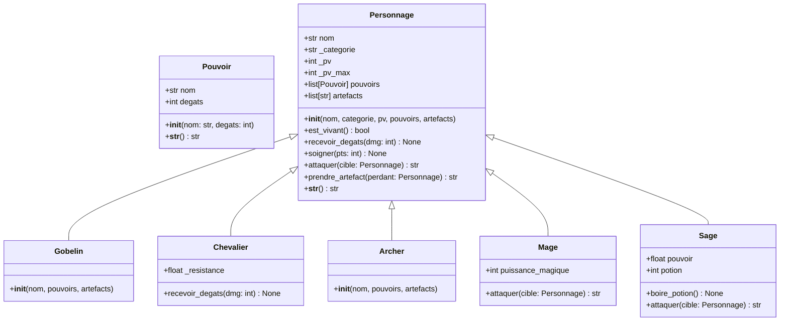

# 🎮 Session Context - Python_Paul_jeu_de_combat

> **Fichier de référence pour redémarrer une session sans ré-explications**
> *Dernière mise à jour automatique : 2026-06-16 19:28:02*
> *Version : 2.0*

---

## 🚀 **INFORMATIONS CLÉS POUR DÉMARRER RAPIDEMENT**

### 📍 **Localisation du projet**
- **Repository GitHub** : `yvespierrecabon/Python_Paul_jeu_de_combat`
- **URL** : `https://github.com/yvespierrecabon/Python_Paul_jeu_de_combat`
- **Chemin local** : `/workspace/yvespierrecabon__Python_Paul_jeu_de_combat`
- **Branch actuelle** : `main`
- **Dernier commit** : `48588b7 - Ajout du système d'automatisation des fichiers de contexte`
>>>>>>> 0e7ab27507284e8384757085de351ddf650b8c5f

### 🎯 **Objectif du projet**
Créer un jeu de combat en Python avec :
- Système de personnages (Gobelin, Chevalier, Mage, Sage, Archer)
- Gestion des pouvoirs et artefacts
- Combats tour par tour avec historique
- Sauvegarde des résultats dans `combats.txt`

### 📁 **Structure complète du projet**

```
Python_Paul_jeu_de_combat/
├── .git/
│   └── hooks/
│       └── pre-commit          # Hook pour auto-mise à jour
├── .idea/                     # Configuration IDE (à ignorer)
├── SESSION_CONTEXT.md         # Ce fichier (contexte session)
├── STATUS.md                  # Point de situation actuel
├── CONTEXT.md                 # Documentation technique existante
├── main.py                    # Point d'entrée + logique combats
├── personnage.py              # Classes Personnage et sous-classes
├── pouvoir.py                 # Classe Pouvoir
├── combats.txt                # Historique des combats
└── update_context.py          # Script d'automatisation
```

---

## 📋 **ÉTAT ACTUEL DU PROJET**

### ✅ **Fonctionnalités implémentées**

| Composant | Statut | Détails |
|-----------|--------|---------|
| **Classes Personnages** | ✅ Complète | Personnage (base), Gobelin, Chevalier, Archer, Mage, Sage |
| **Système de Pouvoirs** | ✅ Complète | Classe Pouvoir avec nom et dégâts |
| **Combats** | ✅ Fonctionnel | Fonction `duel()` avec gestion tour par tour |
| **Artefacts** | ✅ Fonctionnel | Gestion du vol d'artefacts entre personnages |
| **Sauvegarde** | ✅ Fonctionnel | Historique dans `combats.txt` avec horodatage |
| **Affichage** | ✅ Fonctionnel | Méthodes `__str__` pour tous les objets |

### 🔄 **Évolutions récentes**


- **2026-06-16** : Mise à jour automatique via update_context.py
- **2026-06-16** : Ajout du fichier `CONTEXT.md` pour documentation technique
- **2025-11-29** : Création complète de la base de code
  - Classes Personnage et dérivées
  - Système de pouvoirs
  - Fonction duel()
  - Sauvegarde des résultats

### 📊 **Statistiques du code**

- **Fichiers Python** : 4
- **Lignes de code** : ~187 lignes
- **Classes** : 7 (Personnage + 5 sous-classes + Pouvoir)
- **Fonctions principales** : `duel()`, `sauvegarde_resultat()`, `main()`
- **Dernière exécution** : 2026-06-16

---

## 🏗️ **ARCHITECTURE DÉTAILLÉE**

### Diagramme de classes



### 📁 **Rôle de chaque fichier**

#### `pouvoir.py`
- **Classe** : `Pouvoir`
- **Attributs** : `nom` (str), `degats` (int)
- **Méthodes** : `__init__`, `__str__`
- **Utilisation** : Représente les capacités d'attaque des personnages

#### `personnage.py`
- **Classes** : `Personnage` (base) + 5 sous-classes
- **Attributs communs** : `nom`, `_categorie`, `_pv`, `_pv_max`, `pouvoirs`, `artefacts`
- **Méthodes communes** : `est_vivant()`, `recevoir_degats()`, `soigner()`, `attaquer()`, `prendre_artefact()`
- **Spécificités** :
  - `Chevalier` : Résistance aux dégâts (10% de réduction)
  - `Mage` : Puissance magique + dégâts aléatoires
  - `Sage` : Pouvoir qui augmente à chaque attaque + potion de soin

#### `main.py`
- **Fonctions** :
  - `duel(p1, p2)` : Gère un combat entre deux personnages
  - `sauvegarde_resultat(texte)` : Enregistre les résultats dans `combats.txt`
  - `main()` : Point d'entrée, crée les personnages et lance les combats
- **Logique** :
  - Combats tour par tour
  - Gestion de l'historique
  - Sauvegarde avec horodatage

---

## 🔧 **POINTS D'AMÉLIORATION IDENTIFIÉS**

### 🐛 **Bugs potentiels**

| Localisation | Problème | Impact | Priorité |
|--------------|----------|--------|----------|
| `duel()` | Pas de vérification initiale des PV | Combat possible avec personnages morts | ⚠️ Moyenne |
| `duel()` | `prendre_artefact` appelé même si perdant n'a pas d'artefacts | Message inutile dans l'historique | ⚠️ Moyenne |
| `main()` | `histo_` peu clair | Code difficile à maintenir | 🟡 Faible |

### 💡 **Améliorations possibles**

| Type | Suggestion | Bénéfice |
|------|------------|----------|
| **Code** | Remplacer les concatenations par des f-strings | Lisibilité ✅ |
| **Code** | Ajouter typage manquant (`__str__` dans Pouvoir) | Typage complet ✅ |
| **Fonctionnalité** | Ajouter vérification PV avant duel | Robustesse ✅ |
| **Fonctionnalité** | Vérifier artefacts avant `prendre_artefact` | Logique propre ✅ |
| **Architecture** | Utiliser `histo[-1]` au lieu de `histo_` | Code plus clair ✅ |
| **Nouvelle feature** | Ajouter système de niveau/expérience | Évolution du jeu ✅ |
| **Nouvelle feature** | Implémenter interface utilisateur | Meilleure UX ✅ |

---

## 🚀 **COMMENT REDEMARRER UNE SESSION**

### 1️⃣ **Cloner le dépôt (si nouvelle machine)**

```bash
cd /workspace
git clone https://github.com/yvespierrecabon/Python_Paul_jeu_de_combat.git
cd Python_Paul_jeu_de_combat
```

### 2️⃣ **Mettre à jour le dépôt (si déjà cloné)**

```bash
cd /workspace/yvespierrecabon__Python_Paul_jeu_de_combat
git pull origin main
```

### 3️⃣ **Exécuter le projet**

```bash
# Exécution normale
python main.py

# Exécution avec affichage détaillé
python -v main.py

# Vérifier les logs
cat combats.txt
```

### 4️⃣ **Vérifier l'état Git**

```bash
# Voir les modifications
git status

# Voir l'historique
git log --oneline -10

# Voir les différences
git diff
```

---

## 🤖 **AUTOMATISATION DE LA MISE À JOUR**

### 📋 **Fichiers d'automatisation**

1. **`update_context.py`** : Ce script - met à jour SESSION_CONTEXT.md et STATUS.md
2. **`.git/hooks/pre-commit`** : Hook Git pour exécuter automatiquement ce script
3. **`STATUS.md`** : Point de situation généré automatiquement

### 🔄 **Comment ça marche**

```
1. Avant chaque commit :
   pre-commit hook → exécute update_context.py
   
2. update_context.py :
   - Met à jour SESSION_CONTEXT.md avec la date et infos Git
   - Met à jour STATUS.md avec l'état actuel
   - Ajoute les fichiers modifiés au staging
   
3. Résultat :
   - Les fichiers de contexte sont TOUJOURS à jour
   - Pas besoin de ré-explications à chaque session
```

### 🛠️ **Gestion manuelle**

Si le hook ne fonctionne pas :

```bash
# Mettre à jour manuellement
python update_context.py

# Ajouter les fichiers modifiés
git add SESSION_CONTEXT.md STATUS.md

# Commiter
git commit -m "Mise à jour automatique du contexte"

# Pousser
git push origin main
```

### 🎯 **Commandes utiles**

```bash
# Mettre à jour et commiter en une seule commande
python update_context.py && git add SESSION_CONTEXT.md STATUS.md && git commit -m "Mise à jour auto contexte"

# Forcer la mise à jour (même sans changements détectés)
python update_context.py --force

# Mode test (pas d'écriture, juste affichage)
python update_context.py --test
```

---

## 📊 **RÉFÉRENCES RAPIDES**

### Commandes Git utiles

```bash
# Voir les branches
git branch -a

# Changer de branche
git checkout main

# Créer une nouvelle branche
git checkout -b nouvelle-fonctionnalite

# Voir les commits
git log --pretty=format:"%h - %an, %ar : %s"

# Voir les modifications d'un fichier
git log -p main.py
```

### Commandes Python utiles

```bash
# Exécuter avec debug
python -m pdb main.py

# Vérifier la syntaxe
python -m py_compile main.py

# Lister les dépendances
pip list

# Formater le code (si black installé)
black *.py
```

---

## 🎯 **PROCHAINES ÉTAPES SUGGÉRÉES**

### Priorité Haute 🔴
- [ ] Corriger le bug de vérification des PV avant duel
- [ ] Corriger la gestion des artefacts dans `prendre_artefact`

### Priorité Moyenne 🟡
- [ ] Remplacer toutes les concatenations par des f-strings
- [ ] Ajouter le typage manquant
- [ ] Améliorer la gestion de l'historique dans `main()`

### Priorité Basse 🟢
- [ ] Ajouter un système de niveaux
- [ ] Implémenter une interface utilisateur (CLI ou GUI)
- [ ] Ajouter plus de types de personnages
- [ ] Implémenter un système de tournois

---

## 📞 **CONTACT & SUPPORT**

- **Repository** : `yvespierrecabon/Python_Paul_jeu_de_combat`
- **Issues** : Ouvrir une issue sur GitHub pour les bugs
- **Pull Requests** : Bienvenue pour les contributions

---

## 📝 **HISTORIQUE DES MODIFICATIONS**

| Date | Auteur | Modification |
|------|--------|--------------|
| 2026-06-16 | Vibe Code | Mise à jour automatique via update_context.py |
| 2026-06-16 | Vibe Code | Création de SESSION_CONTEXT.md et système d'automatisation |
| 2026-06-16 | yvespierrecabon | Ajout du fichier CONTEXT.md |
| 2025-11-29 | yvespierrecabon | Création initiale du projet |

---

*Ce fichier est généré automatiquement par `update_context.py`.*
*Dernière mise à jour : 2026-06-16 19:28:02*
*Ne pas modifier manuellement sauf pour les corrections urgentes.*
